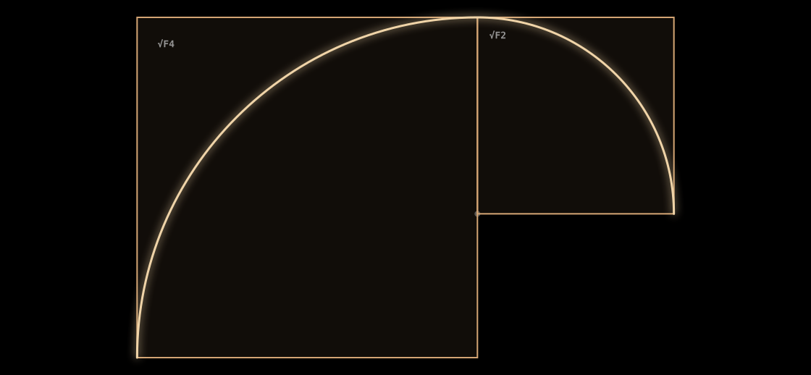
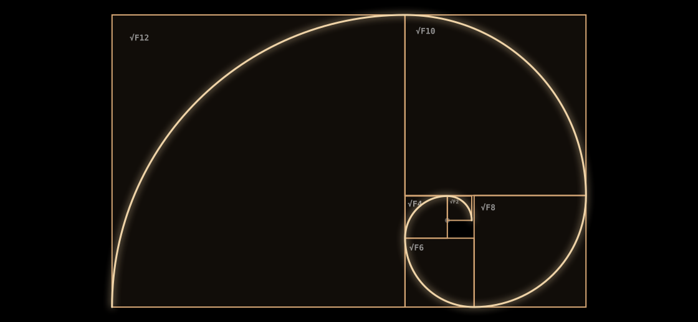
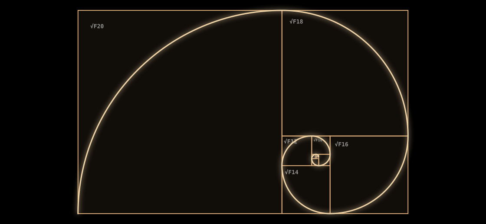

# Zeckendorf Spiral

An interactive visualization of Fibonacci squares inspired by Zeckendorf's Theorem — the principle that every positive integer can be uniquely represented as a sum of non-consecutive Fibonacci numbers.

🌐 **Live Demo**: [zeckendorf.lovable.app](https://zeckendorf.lovable.app)  
📦 **Source Code**: [github.com/pRizz/zeckendorf-spiral](https://github.com/pRizz/zeckendorf-spiral)

## Example of Zeckendorf Spirals

<figure>
  
  <figcaption style="text-align: center;">Zeckendorf Spiral with 2 squares</figcaption>
</figure>

<br />

<figure>
  
  <figcaption style="text-align: center;">Zeckendorf Spiral with 6 squares</figcaption>
</figure>

<br />

<figure>
  
  <figcaption style="text-align: center;">Zeckendorf Spiral with 10 squares</figcaption>
</figure>

## Features

- **Interactive Visualization**: Drag a slider to control the number of Fibonacci squares displayed
- **Golden Spiral**: A smooth curve arcs through each square, tracing the iconic Fibonacci spiral
- **√Fₙ Mode**: Toggle between standard even-indexed Fibonacci numbers and their square roots for square side lengths
- **Theme Support**: Light and dark mode
- **Customizable Labels**: Show/hide square labels
- **Animation Speed Control**: Adjust how quickly squares animate
- **Line Thickness Controls**: Customize spiral and square stroke thickness
- **Export Options**: Save as PNG or SVG, copy link, or use native sharing

## The Math

### Zeckendorf's Theorem
Every positive integer can be uniquely represented as a sum of non-consecutive Fibonacci numbers. For example: 30 = 21 + 8 + 1 = F₈ + F₆ + F₂

### √Fₙ Mode & All Ones Zeckendorf Numbers
When √Fₙ Mode is enabled, square side lengths equal √F₂, √F₄, √F₆, etc. This makes the **sum of the areas** equal to the "All Ones Zeckendorf Number" (AOZN) — a number whose Zeckendorf representation consists entirely of 1-bits.

For example, with 4 squares: √F₂² + √F₄² + √F₆² + √F₈² = 1 + 3 + 8 + 21 = 33, which in Zeckendorf form is `1111`.

## Tech Stack

- React + TypeScript
- Vite
- Tailwind CSS
- shadcn/ui

## Development

```sh
npm install
npm run dev
```

## Learn More

- [Exploring Fibonacci-Based Compression](https://medium.com/@peterryszkiewicz/exploring-fibonacci-based-compression-8713770f5598) — My article explaining using Fibonacci numbers for compression with relationships to Zeckendorf's Theorem

## License

This is a free and open source project.
